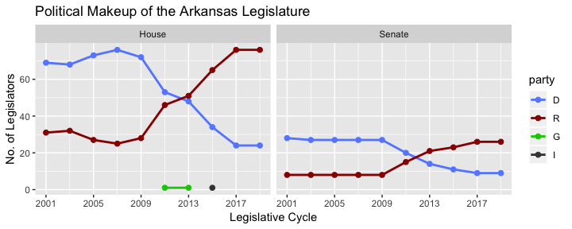
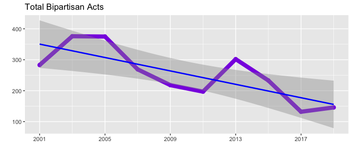

# Overview

This package provides a dataset of Arkansas legislation from 2001-2019
for data exploration, natural language processing, and graph analysis.
The dataset is structured as a nested tibble containing distinct
legislative sessions, nested by cycle (every two years) and session
type. Before we can take a look, we’ll need to load a couple of packages
from the tidyverse:

``` r
library(aRlegislation)
library(dplyr)
library(ggplot2)
library(lubridate)
library(tidyr)
```

As an additional setup step, we’ll set a color palette using familiar
colors for political parties:

``` r
# Use party-related colors
party.colors <- c(
  "R" = "#990000", # dark red = Republicans
  "D" = "#668cff", # light blue = Democrats
  "G" = "#00cc00", # bright green = Green party
  "I" = "#444444", # dark grey = Independent
  "unk" = "#b3b300", # dark yellow = unknown
  "bipartisan" = "#8A2BE2", # purple
  "committee" = "#888888" # medium grey
)
```

Now, we can take a look at the structure of the dataset:

``` r
head(legislation)
```

    ## # A tibble: 6 x 5
    ##   cycle session acts                 sponsors           sponsorship        
    ##   <dbl> <chr>   <list>               <list>             <list>             
    ## 1  2001 R       <tibble [1,843 × 6]> <tibble [136 × 11… <tibble [4,814 × 2…
    ## 2  2001 S1      <tibble [2 × 6]>     <tibble [86 × 11]> <tibble [86 × 2]>  
    ## 3  2003 R       <tibble [1,816 × 6]> <tibble [135 × 11… <tibble [5,683 × 2…
    ## 4  2003 S1      <tibble [63 × 6]>    <tibble [6 × 11]>  <tibble [66 × 2]>  
    ## 5  2003 S2      <tibble [110 × 6]>   <tibble [124 × 11… <tibble [473 × 2]> 
    ## 6  2005 R       <tibble [2,325 × 6]> <tibble [135 × 11… <tibble [6,128 × 2…

There are three different datasets for each legislative cycle and
session:

  - acts, which contains act number, bill number, title, subtitle, text,
    and partisanship
  - sponsors, which contains demographic information about lawmakers
    such as chamber, political party, and district
  - sponsorship, which is a simple table containing only act number and
    sponsor name in a manner suitable for creating network graphs

Below, we’ll take a look at each type of nested tibble, and we’ll
provide an example or two of analyses that can be performed using each
type of tibble.

## Sponsors

For purposes of this dataset, the term “sponsor” refers to one or more
lawmakers that propose an enacted bill during a legislative session. A
sponsor can be an individual lawmaker, or it can be a committee. Here’s
what the structure of one of the sponsors tibbles looks like:

``` r
head(legislation$sponsors[[1]])
```

    ## # A tibble: 6 x 11
    ##   sponsor sponsor_full_na… chamber party committee seniority district
    ##   <fct>   <fct>            <ord>   <ord> <chr>         <dbl>    <dbl>
    ## 1 Adams   Representative … House   D     TASK FOR…       -73       48
    ## 2 Agee    Representative … House   R     ARKANSAS…       -46        9
    ## 3 Allison Representative … House   D     PUBLIC T…        -9       86
    ## 4 Altes   Representative … House   R     PUBLIC H…       -66       14
    ## 5 Argue   Senator Jim Arg… Senate  D     ALC/JBC …       -13       15
    ## 6 B. Joh… Senator Bob Joh… Senate  D     AGRICULT…       -34       25
    ## # … with 4 more variables: occupation <chr>, church <chr>, veteran <chr>,
    ## #   public_service <chr>

As an example, we can look at the political makeup of the lawmakers in
each regular-session legislative chamber over time pretty easily:\[1\]

``` r
legislation %>%
  filter(grepl("R", session)) %>%
  unnest(sponsors) %>%
  filter(! grepl("Budget|Committee|Management|Senate|Efficiency|Insurance|Agencies", sponsor)) %>%
  count(cycle, session, party, chamber) %>%
  ggplot(aes(y = n, x = cycle, color = party)) +
    geom_point(size = 2) +
    geom_line(size = 1) +
    facet_wrap(~ chamber) +
    scale_x_continuous(
      breaks = seq(from = 2001, to = 2019, by = 4), 
      minor_breaks = seq(from = 2001, to = 2019, by = 2)
    ) +
    scale_color_manual(values = party.colors) +
    labs(
      x = "Legislative Cycle",
      y = "No. of Legislators",
      title = "Political Makeup of the Arkansas Legislature"
    )
```

<!-- -->

This graph shows a very pronounced switch in the makeup of both chambers
of the Arkansas legislature between 2009 and 2017.

## Sponsorship

Sponsorship refers to individual laws that each lawmaker presents to the
legislative chamber. Some bills have a single sponsor, while others have
many. Bills can be sponsored by lawmakers in both chambers, or by a
committee belonging to neither chamber. This table is a two-column
layout with a single act and sponsor per row:

``` r
head(legislation$sponsorship[[1]])
```

    ## # A tibble: 6 x 2
    ##     act sponsor               
    ##   <dbl> <chr>                 
    ## 1     1 Senate Efficiency     
    ## 2     2 Bevis                 
    ## 3     3 Magnus                
    ## 4     3 Broadway              
    ## 5     3 K. Smith              
    ## 6     4 Joint Budget Committee

The purpose of this simple layout is to facilitate graph analysis. The
sponsor table contains information about vertices, and the sponsorship
table contains information about the edges.

A simple example from the 2019 regular session illustrates:

``` r
### New tidygraph code
```

## Acts

The acts tibbles contain the text of laws passed during each
cycle/session, along with a little bit of metadata about the acts:

``` r
head(legislation$acts[[1]])
```

    ## # A tibble: 6 x 6
    ##     act partisan  bill_no title           subtitle          text           
    ##   <dbl> <chr>     <chr>   <chr>           <chr>             <chr>          
    ## 1     1 committee 1       AN ACT TO MAKE… AN ACT FOR THE A… "\n\nSECTION 1…
    ## 2     2 D         1001    AN ACT TO MAKE… AN ACT FOR THE A… "\n\nSECTION 1…
    ## 3     3 bipartis… 1143    AN ACT TO CHAN… AN ACT TO CHANGE… "\n\nSECTION 1…
    ## 4     4 committee 1156    AN ACT TO MAKE… THE GENERAL APPR… "\n\nSECTION 1…
    ## 5     5 D         68      AN ACT TO PROV… TO PROVIDE THAT … "\n\nSECTION 1…
    ## 6     6 committee 1168    AN ACT TO MAKE… AN ACT FOR THE A… "\n\nSECTION 1…

The act text has been lightly processed such that it is still
human-readable, especially in monospace type. A really short act
provides an example:

<blockquote>

SECTION 1. Arkansas Code 14-121-305(b)(2), pertaining to drainage
improvement districts, is amended to read as follows: (2) No work
exceeding ten thousand dollars ($10,000) twenty thousand dollars
($20,000) shall be let without public advertisement.

APPROVED: 2 9 2001

.

</blockquote>

The metadata includes a calculated partisan value based on the political
party of the bill sponsors, as follows:

  - If any sponsor is a committee, the partisan value is set to
    committee
  - If all sponsors are in the same party, the partisan value is set to
    the value of that party
  - If the sponsors are of mixed political parties, the partisan value
    is set to bipartisan

The partisan value allows us to look at trends about bipartisanship over
time, as follows:

``` r
legislation %>%
  unnest(acts) %>%
  filter(partisan == "bipartisan") %>%
  count(cycle, partisan) %>% # counts number of parties sponsoring acts
  ggplot(aes(y = n, x = cycle, color = partisan)) +
    geom_point(size = 2.5) +
    geom_line(size = 3) +
    geom_smooth(method = "lm", color = "blue", se = T) +
    scale_x_continuous(
      breaks = seq(from = 2001, to = 2019, by = 4), 
      minor_breaks = seq(from = 2001, to = 2019, by = 2)
    ) +
    scale_color_manual(values = party.colors) +
    labs(
      title = "Total Bipartisan Acts",
      x = "",
      y = "",
      caption = ""
    ) +
    theme(
      legend.text = element_text(size = 6),
      legend.position = "none"
    )
```

<!-- -->

We can see here that the total number of bipartisan acts has been
declining over time.

# Future Plans

This dataset is essentially an aggregation of distinct datasets across
each cycle/session of the legislature. This works well to allow us to
see trends across cycles/sessions, but it doesn’t give much visibility
into how individual lawmakers act as they get re-elected, gain
experience, and perhaps graduate from House to Senate as term limits
force them out of office. As such, entity resolution of lawmakers across
cycles/sessions will likely be the next major version of this dataset.

1.  To keep things simple, we’ll just look at regular legislative
    sessions for now. Also, committees have been excluded from this
    graph because they don’t necessarily belong to a specific chamber.
