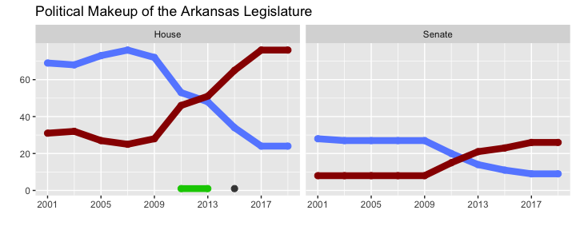
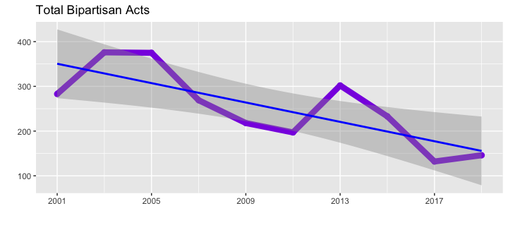
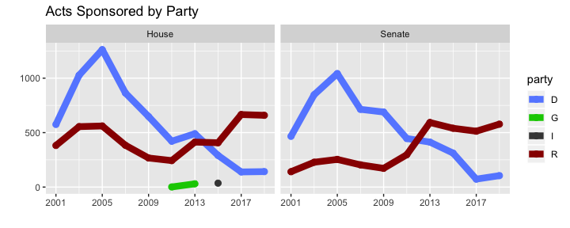
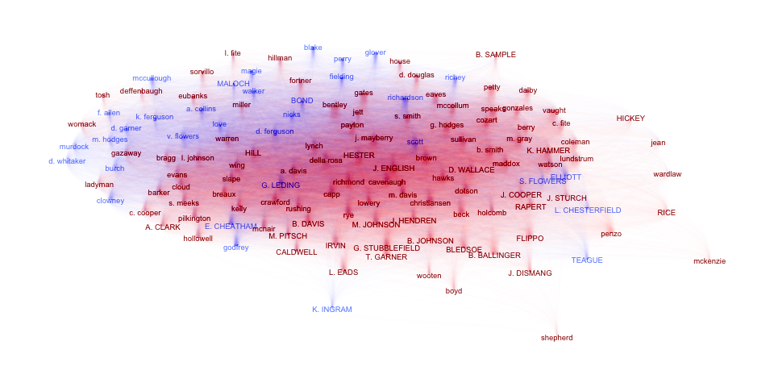

# aRlegislation

[](https://travis-ci.com/titaniumtroop/aRlegislation)

This package provides a dataset of Arkansas legislation from 2001-2019
for data exploration, natural language processing, and graph analysis.
The dataset is structured as a nested tibble containing distinct
legislative sessions, nested by cycle (every two years) and session
type.

Before we can take a look, we’ll need to load a couple of packages from
the tidyverse that will help us access the nested tibbles:

``` r
library(aRlegislation)
library(dplyr)
library(ggplot2)
library(tidyr) # needed for nest/unnest operations
library(tidygraph)
library(ggraph)
```

Now, we can take a look at the structure of the dataset:

``` r
head(legislation)
```

    ## # A tibble: 6 x 5
    ##   cycle session acts                 lawmakers          sponsorship        
    ##   <dbl> <chr>   <list>               <list>             <list>             
    ## 1  2001 R       <tibble [1,843 × 6]> <tibble [136 × 11… <tibble [4,814 × 2…
    ## 2  2001 S1      <tibble [2 × 6]>     <tibble [86 × 11]> <tibble [86 × 2]>  
    ## 3  2003 R       <tibble [1,816 × 6]> <tibble [135 × 11… <tibble [5,683 × 2…
    ## 4  2003 S1      <tibble [63 × 6]>    <tibble [6 × 11]>  <tibble [66 × 2]>  
    ## 5  2003 S2      <tibble [110 × 6]>   <tibble [124 × 11… <tibble [473 × 2]> 
    ## 6  2005 R       <tibble [2,325 × 6]> <tibble [135 × 11… <tibble [6,128 × 2…

There are three different datasets for each legislative cycle and
session:

  - `acts`: contains act number, bill number, title, subtitle, text, and
    partisanship
  - `lawmakers`: contains demographic information about elected senators
    and representatives such as chamber, political party, and district
  - `sponsorship`: a simple table containing act number and sponsor name

Below, we’ll take a look at each type of nested tibble, and we’ll
provide an example or two of analyses that can be performed using each
type of tibble.

## Lawmakers

For purposes of this dataset, the term “sponsor” refers to one or more
lawmakers or committees that propose an enacted bill during a
legislative session. This table contains demographic information about
lawmakers, so it excludes committees – hence the name. Here’s what the
structure of one of the lawmakers tibbles looks like:

``` r
head(legislation$lawmakers[[1]])
```

    ## # A tibble: 6 x 11
    ##   sponsor sponsor_full_na… chamber party committee seniority district
    ##   <chr>   <chr>            <chr>   <chr> <chr>         <dbl>    <dbl>
    ## 1 Adams   Representative … House   D     TASK FOR…       -73       48
    ## 2 Agee    Representative … House   R     ARKANSAS…       -46        9
    ## 3 Allison Representative … House   D     PUBLIC T…        -9       86
    ## 4 Altes   Representative … House   R     PUBLIC H…       -66       14
    ## 5 Argue   Senator Jim Arg… Senate  D     ALC/JBC …       -13       15
    ## 6 B. Joh… Senator Bob Joh… Senate  D     AGRICULT…       -34       25
    ## # … with 4 more variables: occupation <chr>, church <chr>, veteran <chr>,
    ## #   public_service <chr>

As an example, we can look at the political makeup of the lawmakers in
each regular-session legislative chamber over time pretty easily:

``` r
# Use party-related colors
party.colors <- c(
  "R" = "#990000", # dark red = Republicans
  "D" = "#668cff", # light blue = Democrats
  "G" = "#00cc00", # bright green = Green party
  "I" = "#444444", # dark grey = Independent
  "unk" = "#b3b300", # dark yellow = unknown
  "bipartisan" = "#8A2BE2", # purple
  "committee" = "#888888" # medium grey
)

legislation %>%
  filter(grepl("R", session)) %>% # regular sessions only
  unnest(lawmakers) %>%
  count(cycle, session, party, chamber) %>%
  ggplot(aes(y = n, x = cycle, color = party)) +
    geom_point(size = 2.5) +
    geom_line(size = 3) +
    facet_wrap(~ chamber) +
    scale_x_continuous(
      breaks = seq(from = 2001, to = 2019, by = 4), 
      minor_breaks = seq(from = 2001, to = 2019, by = 2)
    ) +
    scale_color_manual(values = party.colors) +
    labs(
      x = "",
      y = "",
      title = "Political Makeup of the Arkansas Legislature"
    ) +
    theme(legend.position = "none")
```

<!-- -->

This graph shows a very pronounced switch in the makeup of both chambers
of the Arkansas legislature between 2009 and 2017.

## Acts

The acts tibbles contain the text of laws passed during each
cycle/session, along with a little bit of metadata about the acts:

``` r
head(legislation$acts[[1]])
```

    ## # A tibble: 6 x 6
    ##     act partisan  bill_no title           subtitle          text           
    ##   <dbl> <chr>     <chr>   <chr>           <chr>             <chr>          
    ## 1     1 committee 1       AN ACT TO MAKE… AN ACT FOR THE A… "SECTION 1. AP…
    ## 2     2 D         1001    AN ACT TO MAKE… AN ACT FOR THE A… "SECTION 1. AP…
    ## 3     3 bipartis… 1143    AN ACT TO CHAN… AN ACT TO CHANGE… "SECTION 1.   …
    ## 4     4 committee 1156    AN ACT TO MAKE… THE GENERAL APPR… "SECTION 1. AP…
    ## 5     5 D         68      AN ACT TO PROV… TO PROVIDE THAT … "SECTION 1.   …
    ## 6     6 committee 1168    AN ACT TO MAKE… AN ACT FOR THE A… "SECTION 1. AP…

The act text has been lightly processed such that it is still
human-readable, especially in monospace type. A really short act
provides an example:

<blockquote>

SECTION 1. Arkansas Code 14-121-305(b)(2), pertaining to drainage
improvement districts, is amended to read as follows: (2) No work
exceeding ten thousand dollars ($10,000) twenty thousand dollars
($20,000) shall be let without public advertisement.

</blockquote>

The act titles, subtitles, and text are suitable for natural language
processing analysis, although examples of such are beyond the scope of
this introduction.

The metadata includes a calculated partisan value based on the political
party of the bill sponsors, as follows:

  - If any sponsor is a committee, the partisan value is set to
    committee
  - If all sponsors are lawmakers in the same party, the partisan value
    is set to the value of that party
  - If the sponsors are lawmakers of mixed political parties, the
    partisan value is set to bipartisan

The partisan value allows us to look at trends about bipartisanship over
time, as follows:

``` r
legislation %>%
  unnest(acts) %>%
  filter(partisan == "bipartisan") %>%
  count(cycle, partisan) %>% # counts number of parties sponsoring acts
  ggplot(aes(y = n, x = cycle, color = partisan)) +
    geom_point(size = 2.5) +
    geom_line(size = 3) +
    geom_smooth(method = "lm", color = "blue", se = T) +
    scale_x_continuous(
      breaks = seq(from = 2001, to = 2019, by = 4), 
      minor_breaks = seq(from = 2001, to = 2019, by = 2)
    ) +
    scale_color_manual(values = party.colors) +
    labs(
      title = "Total Bipartisan Acts",
      x = "",
      y = "",
      caption = ""
    ) +
    theme(
      legend.text = element_text(size = 6),
      legend.position = "none"
    )
```

<!-- -->

We can see here that the total number of bipartisan acts has been
declining over time.

## Sponsorship

Sponsorship refers to individual laws that each lawmaker or committee
presents to the legislative chamber. Some bills have a single sponsor,
while others have many. Bills can be sponsored by lawmakers in one or
both chambers, by a committee belonging to neither chamber, or some
combination thereof. Since the number of lawmakers/committees that
sponsor laws can change, this table is a two-column layout with a unique
combination of act and sponsor per row:

``` r
head(legislation$sponsorship[[1]])
```

    ## # A tibble: 6 x 2
    ##     act sponsor               
    ##   <dbl> <chr>                 
    ## 1     1 Senate Efficiency     
    ## 2     2 Bevis                 
    ## 3     3 Magnus                
    ## 4     3 Broadway              
    ## 5     3 K. Smith              
    ## 6     4 Joint Budget Committee

The purpose of this simple layout is twofold. First, we want to be able
to look at summary statistics about the number of sponsors per act. For
instance, we can look at the total number of sponorships by each
political party over time, which tells us how much credit each party’s
lawmakers claim for legislation:

``` r
legislation %>%
  unnest(sponsorship) %>%
   left_join(
    legislation %>% unnest(lawmakers),
    by = c("cycle", "session", "sponsor")
  ) %>%
  filter(!is.na(chamber)) %>% # No committee acts
  count(cycle, party, chamber, act) %>% # counts all sponsors who signed onto acts
  count(cycle, party, chamber) %>% # counts acts themselves
  ggplot(aes(y = n, x = cycle, color = party)) +
    geom_point(size = 2.5) +
    geom_line(size = 3) +
    facet_wrap(~ chamber) +
    scale_x_continuous(
      breaks = seq(from = 2001, to = 2019, by = 4), 
      minor_breaks = seq(from = 2001, to = 2019, by = 2)
    ) +
    scale_color_manual(values = party.colors) +
    labs(
      title = "Acts Sponsored by Party",
      x = "", y = ""
    )
```

<!-- -->

This plot shows an unexpected result for the House —- as seen above, the
Democratic representatives lost the majority in the House in 2013, but
they still sponsored more acts than Republican representatives.

The second purpose of the sponsorship tibble to facilitate graph
analysis. The sponsorship table contains information about graph edges,
and the sponsor table contains additional information about graph
vertices (that is, where vertices are lawmakers and not committees).

We’ll illustrate how the graph works with an example from the 2019
regular session. This is a little more in-depth than the previous
examples, since we’ll need to generate a to-from relationship from the
raw data about sponsorships. The pipeline is a little on the long side,
so here are the steps:

  - Link the raw sponsorship data with the sponsor table to generate a
    list of lawmakers and their party affiliations
  - Rename columns to indicate this is the “from” tibble
  - Repeat step 1
  - Rename columns to indicate this is the “to” tibble
  - Join the from and to tibbles
  - Filter out any duplicate records, since there’s no directionality to
    sponsorship
  - Count the number of links between lawmakers
  - Identify whether those links are bipartisan or not
  - Create the graph
  - Add metadata to the nodes so we can color them appropriately
  - Use uppercase for lawmakers in the Senate and lowercase for those in
    the House

<!-- end list -->

``` r
selected.cycle <- 27

sponsorship_graph <- legislation$sponsorship[[selected.cycle]] %>%
  right_join( # Right join, because we are excluding committees
      legislation$lawmakers[[selected.cycle]] %>%
        select(sponsor, party),
        by = "sponsor"
  ) %>%
  rename(from = sponsor, from.party = party) %>%
  left_join(
    legislation$sponsorship[[selected.cycle]] %>% 
      right_join( # Right join, because we are excluding committees
        legislation$lawmakers[[selected.cycle]] %>%
        select(sponsor, party, chamber),
        by = "sponsor"
    ) 
    %>% rename(to = sponsor, to.party = party), 
    by = "act"
  ) %>% 
  select(from, from.party, to, to.party, act) %>%
  filter(from < to) %>% # filters duplicate rows; links are unordered
  group_by(from, from.party, to, to.party) %>%
  count(from, from.party, to, to.party) %>% 
  ungroup() %>%
  mutate(
    wt = log(n + 1),
    partisan = ifelse(to.party == from.party, to.party, "bipartisan")
  ) %>%
  arrange(desc(wt)) %>%
  as_tbl_graph() %>%
  activate(nodes) %>%
  left_join(
    legislation$lawmakers[[selected.cycle]] %>%
        select(sponsor, party, chamber),
        by = c("name" = "sponsor")
  ) %>%
  mutate(name = ifelse(chamber == "Senate", toupper(name), tolower(name)))

sponsorship_graph
```

    ## # A tbl_graph: 135 nodes and 8173 edges
    ## #
    ## # A directed acyclic simple graph with 1 component
    ## #
    ## # Node Data: 135 x 3 (active)
    ##   name         party chamber
    ##   <chr>        <chr> <chr>  
    ## 1 bentley      R     House  
    ## 2 gazaway      R     House  
    ## 3 b. smith     R     House  
    ## 4 capp         R     House  
    ## 5 lundstrum    R     House  
    ## 6 B. BALLINGER R     Senate 
    ## # … with 129 more rows
    ## #
    ## # Edge Data: 8,173 x 7
    ##    from    to from.party to.party     n    wt partisan
    ##   <int> <int> <chr>      <chr>    <int> <dbl> <chr>   
    ## 1     1     5 R          R           27  3.33 R       
    ## 2     2    88 R          R           24  3.22 R       
    ## 3     1    49 R          R           23  3.18 R       
    ## # … with 8,170 more rows

With the graph constructed from the table of links, we can now visualize
the links between the lawmakers:

``` r
sponsorship_graph %>%
  mutate(degree = centrality_degree(weights = n)) %>%
  ggraph(layout = "fr") +
    geom_node_text(aes(label = name, color = party), size = 2.5) +
    geom_edge_diagonal(aes(edge_color = partisan, edge_width = wt / 10), edge_alpha = 0.005) +
    scale_color_manual(values = party.colors) +
    scale_edge_color_manual(values = party.colors) +
    theme_graph() +
    theme(legend.position = "none")
```

<!-- -->

# Future Plans

The legislature meets once a year, plus special sessions, so the dataset
can be updated as each additional session concludes.

This dataset is essentially an aggregation of distinct datasets across
each cycle/session of the legislature. This works well to allow us to
see trends across cycles/sessions, but it doesn’t give much visibility
into how individual lawmakers act as they get re-elected, gain
experience, and perhaps graduate from House to Senate as term limits
force them out of office. As such, entity resolution of lawmakers across
cycles/sessions will likely be the focus of the next major version of
this dataset.
