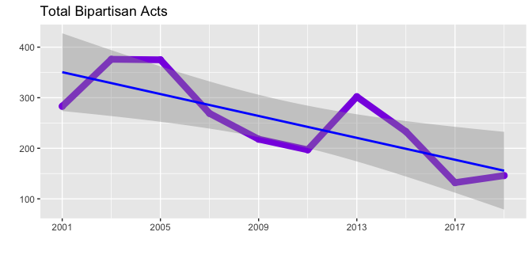

Acts
================

This vignette examines the structure of the `acts` tibbles contained
within the `legislation` dataset and displays the partisanship of the
Arkansas Legislature over time as an exmample use case.

``` r
library(aRlegislation)
library(dplyr)
library(tidyr) # needed for nest/unnest operations
library(ggplot2)
```

The `acts` tibbles contain the text of laws passed during each
cycle/session, along with a little bit of metadata about the acts:

``` r
head(legislation$acts[[1]])
#> # A tibble: 6 x 6
#>     act partisan  bill_no title                                                        subtitle                                                    text                                                       
#>   <dbl> <chr>     <chr>   <chr>                                                        <chr>                                                       <chr>                                                      
#> 1     1 committee 1       AN ACT TO MAKE AN APPROPRIATION TO THE ARKANSAS SENATE FOR … AN ACT FOR THE ARKANSAS SENATE EXPENSES APPROPRIATION.      "SECTION 1. APPROPRIATIONS.             There is hereby ap…
#> 2     2 D         1001    AN ACT TO MAKE AN APPROPRIATION FOR NECESSARY EXPENSES, PAY… AN ACT FOR THE ARKANSAS HOUSE OF REPRESENTATIVES OF THE EI… "SECTION 1. APPROPRIATION. There is hereby appropriated, t…
#> 3     3 bipartis… 1143    AN ACT TO CHANGE THE MEMBERSHIP OF THE JOINT COMMITTEE ON A… AN ACT TO CHANGE THE MEMBERSHIP OF THE JOINT COMMITTEE ON … "SECTION 1.     Arkansas Code 10-3-1703(b)(1)(B)(i), perta…
#> 4     4 committee 1156    AN ACT TO MAKE AN APPROPRIATION FOR THE ORDINARY EXPENSES O… THE GENERAL APPROPRATION ACT FOR THE ORDINARY EXPENSES OF … "SECTION 1. APPROPRIATION - AUDITOR OF STATE DISBURSEMENTS…
#> 5     5 D         68      AN ACT TO PROVIDE THAT ANY JUDGE REMOVED FROM OFFICE SHALL … TO PROVIDE THAT ANY JUDGE REMOVED FROM OFFICE SHALL NOT TH… "SECTION 1.     Arkansas Code 16-10-410(d) is amended to r…
#> 6     6 committee 1168    AN ACT TO MAKE AN APPROPRIATION FOR OPERATING EXPENSES FOR … AN ACT FOR THE ARKANSAS BOARD OF PODIATRIC MEDICINE - OPER… "SECTION 1. APPROPRIATION - CASH OPERATIONS. There is here…
```

The act text has been lightly processed such that it is still
human-readable. A really short act provides an example:

<blockquote>

SECTION 1. Arkansas Code 14-121-305(b)(2), pertaining to drainage
improvement districts, is amended to read as follows: (2) No work
exceeding ten thousand dollars ($10,000) twenty thousand dollars
($20,000) shall be let without public advertisement.

</blockquote>

The act titles, subtitles, and text are suitable for natural language
processing analysis, although examples of such are beyond the scope of
this introduction. The text above illustrates one caveat: for acts that
are amended, both the deleted text and the new text appears in the
corpus \[e.g., the act referenced above increases the dollar threshold
from ~~ten thousand dollars ($10,000)~~ to **twenty thousand dollars
($20,000)**\].

The metadata includes a calculated partisan value based on the political
party of the bill sponsors, as follows:

  - If any sponsor is a committee, the partisan value is set to
    committee
  - If all sponsors are lawmakers in the same party, the partisan value
    is set to the value of that party
  - If the sponsors are lawmakers of mixed political parties, the
    partisan value is set to bipartisan

The partisan value allows us to look at trends about bipartisanship over
time, as follows:

``` r
party.colors <- c(
  "R" = "#990000", # dark red = Republicans
  "D" = "#668cff", # light blue = Democrats
  "G" = "#00cc00", # bright green = Green party
  "I" = "#444444", # dark grey = Independent
  "unk" = "#b3b300", # dark yellow = unknown
  "bipartisan" = "#8A2BE2", # purple
  "committee" = "#888888" # medium grey
)

legislation %>%
  unnest(acts) %>%
  filter(partisan == "bipartisan") %>%
  count(cycle, partisan) %>% # counts number of parties sponsoring acts
  ggplot(aes(y = n, x = cycle, color = partisan)) +
    geom_point(size = 2.5) +
    geom_line(size = 3) +
    geom_smooth(method = "lm", color = "blue", se = T) +
    scale_x_continuous(
      breaks = seq(from = 2001, to = 2019, by = 4), 
      minor_breaks = seq(from = 2001, to = 2019, by = 2)
    ) +
    scale_color_manual(values = party.colors) +
    labs(
      title = "Total Bipartisan Acts",
      x = "",
      y = "",
      caption = ""
    ) +
    theme(
      legend.text = element_text(size = 6),
      legend.position = "none"
    )
#> `geom_smooth()` using formula 'y ~ x'
```

<!-- -->

We can see here that the total number of bipartisan acts has been
declining over time.
