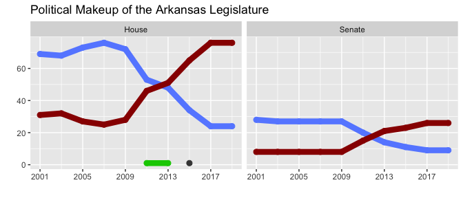

Lawmakers
================

This vignette examines the structure of the `lawmakers` tibbles
contained within the `legislation` dataset and displays the political
makeup of the Arkansas Legislature over time as an example use case.

``` r
library(aRlegislation)
library(dplyr)
library(tidyr) # needed for nest/unnest operations
library(ggplot2)
```

For purposes of this dataset, the term “sponsor” refers to one or more
lawmakers or committees that propose an enacted bill during a
legislative session. This table contains demographic information about
lawmakers, so it excludes committees – hence the name. Here’s what the
structure of one of the lawmakers tibbles looks like:

``` r
head(legislation$lawmakers[[1]])
#> # A tibble: 6 x 11
#>   sponsor   sponsor_full_name chamber party committee                                seniority district occupation                           church        veteran       public_service                       
#>   <chr>     <chr>             <chr>   <chr> <chr>                                    <chr>        <dbl> <chr>                                <chr>         <chr>         <chr>                                
#> 1 Adams     Bob Adams         House   D     TASK FORCE ON METHAMPHETAMINE (ACT 1684… 73              48 Grant County Sheriff                 Baptist       <NA>          Grant County Sheriff, House 2001     
#> 2 Agee      Sarah Agee        House   R     ARKANSAS LEGISLATIVE COUNCIL (ALC)       46               9 Cattle Producer/Residential Develop… Baptist       <NA>          Prairie Grove School District Board …
#> 3 Allison   Jerry Allison     House   D     PUBLIC TRANSPORTATION- HOUSE             9               86 Owner, Allison Manufactured Homes, … Methodist     AR National … Chairman of the Board AR Manufacture…
#> 4 Altes     Denny Altes       House   R     PUBLIC HEALTH- HOUSE LABOR & ENVIRONMEN… 66              14 Recycler (paper)                     Baptist       <NA>          Justice of the Peace (Quorum Court);…
#> 5 Argue     Jim Argue         Senate  D     ALC/JBC APPROVED CLAIMS-SPECIAL CLAIMS … 13              15 Foundation Executive, United Method… United Metho… <NA>          House in 1991, 1993, 1995, Senate 19…
#> 6 B. Johns… Bob Johnson       Senate  D     AGRICULTURE-SENATE SMALL BUSINESS & ECO… 34              25 <NA>                                 Baptist       <NA>          House in 1995, 1997, 1999, Senate 20…
```

As an example, we can look at the political makeup of the lawmakers in
each regular-session legislative chamber over time pretty easily:

``` r
# Use party-related colors
party.colors <- c(
  "R" = "#990000", # dark red = Republicans
  "D" = "#668cff", # light blue = Democrats
  "G" = "#00cc00", # bright green = Green party
  "I" = "#444444", # dark grey = Independent
  "unk" = "#b3b300", # dark yellow = unknown
  "bipartisan" = "#8A2BE2", # purple
  "committee" = "#888888" # medium grey
)

legislation %>%
  filter(grepl("R", session)) %>% # regular sessions only
  unnest(lawmakers) %>%
  count(cycle, session, party, chamber) %>%
  ggplot(aes(y = n, x = cycle, color = party)) +
    geom_point(size = 2.5) +
    geom_line(size = 3) +
    facet_wrap(~ chamber) +
    scale_x_continuous(
      breaks = seq(from = 2001, to = 2019, by = 4), 
      minor_breaks = seq(from = 2001, to = 2019, by = 2)
    ) +
    scale_color_manual(values = party.colors) +
    labs(
      x = "",
      y = "",
      title = "Political Makeup of the Arkansas Legislature"
    ) +
    theme(legend.position = "none")
```

<!-- -->

This graph shows a very pronounced switch in the makeup of both chambers
of the Arkansas legislature between 2009 and 2017.
