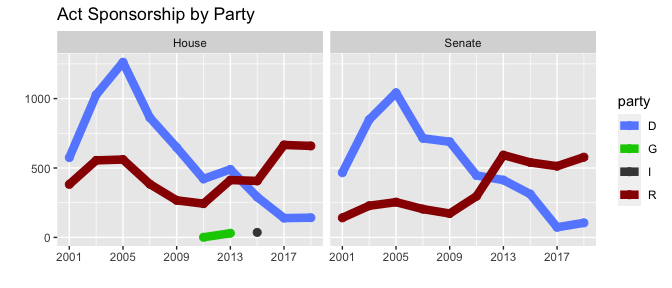
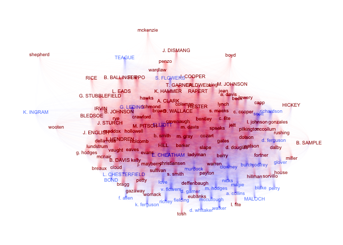

Sponsorship
================

This vignette examines the structure of the `sponsorship` tibbles
contained within the `legislation` dataset and renders a network graph
as an example use case.

``` r
library(aRlegislation)
library(dplyr)
library(tidyr) # needed for nest/unnest operations
library(tidygraph)
library(ggraph)
```

Sponsorship refers to individual laws that each lawmaker or committee
presents to the legislative chamber. Some bills have a single sponsor,
while others have many. Bills can be sponsored by lawmakers in one or
both chambers, by a committee belonging to neither chamber, or some
combination thereof. Since the number of lawmakers/committees that
sponsor laws can change, this table is a two-column layout with a unique
combination of act and sponsor per row:

``` r
head(legislation$sponsorship[[1]])
#> # A tibble: 6 x 2
#>     act sponsor               
#>   <dbl> <chr>                 
#> 1     1 Senate Efficiency     
#> 2     2 Bevis                 
#> 3     3 Magnus                
#> 4     3 Broadway              
#> 5     3 K. Smith              
#> 6     4 Joint Budget Committee
```

## Summary Statistics

The purpose of this simple layout is twofold. First, we want to be able
to look at summary statistics about the number of sponsors per act. For
instance, we can look at the total number of sponorships by each
political party over time, which tells us how much credit each party’s
lawmakers claim for legislation:

``` r
party.colors <- c(
  "R" = "#990000", # dark red = Republicans
  "D" = "#668cff", # light blue = Democrats
  "G" = "#00cc00", # bright green = Green party
  "I" = "#444444", # dark grey = Independent
  "unk" = "#b3b300", # dark yellow = unknown
  "bipartisan" = "#8A2BE2", # purple
  "committee" = "#888888" # medium grey
)

legislation %>%
  unnest(sponsorship) %>%
   left_join(
    legislation %>% unnest(lawmakers),
    by = c("cycle", "session", "sponsor")
  ) %>%
  filter(!is.na(chamber)) %>% # No committee acts
  count(cycle, party, chamber, act) %>% # counts all sponsors who signed onto acts
  count(cycle, party, chamber) %>% # counts acts themselves
  ggplot(aes(y = n, x = cycle, color = party)) +
    geom_point(size = 2.5) +
    geom_line(size = 3) +
    facet_wrap(~ chamber) +
    scale_x_continuous(
      breaks = seq(from = 2001, to = 2019, by = 4), 
      minor_breaks = seq(from = 2001, to = 2019, by = 2)
    ) +
    scale_color_manual(values = party.colors) +
    labs(
      title = "Act Sponsorship by Party",
      x = "", y = ""
    )
```

<!-- -->

## Graph Analysis

The second purpose of the sponsorship tibble to facilitate graph
analysis. The sponsorship table contains information about graph edges,
and the sponsor table contains additional information about graph
vertices (that is, where vertices are lawmakers and not committees).

We’ll illustrate how the graph works with an example from the 2019
regular session. This is a little more in-depth than the previous
examples, since we’ll need to generate a to-from relationship from the
raw data about sponsorships. The pipeline is a little on the long side,
so here are the steps:

  - Link the raw sponsorship data with the sponsor table to generate a
    list of lawmakers and their party affiliations
  - Rename columns to indicate this is the “from” tibble
  - Repeat step 1
  - Rename columns to indicate this is the “to” tibble
  - Join the from and to tibbles
  - Filter out any duplicate records, since there’s no directionality to
    sponsorship
  - Count the number of links between lawmakers
  - Identify whether those links are bipartisan or not
  - Create the graph
  - Add metadata to the nodes so we can color them appropriately
  - Use uppercase for lawmakers in the Senate and lowercase for those in
    the House

<!-- end list -->

``` r
selected.cycle <- 27

sponsorship_graph <- legislation$sponsorship[[selected.cycle]] %>%
  right_join( # Right join, because we are excluding committees
      legislation$lawmakers[[selected.cycle]] %>%
        select(sponsor, party),
        by = "sponsor"
  ) %>%
  rename(from = sponsor, from.party = party) %>%
  left_join(
    legislation$sponsorship[[selected.cycle]] %>% 
      right_join( # Right join, because we are excluding committees
        legislation$lawmakers[[selected.cycle]] %>%
        select(sponsor, party, chamber),
        by = "sponsor"
    ) 
    %>% rename(to = sponsor, to.party = party), 
    by = "act"
  ) %>% 
  select(from, from.party, to, to.party, act) %>%
  filter(from < to) %>% # filters duplicate rows; links are unordered
  group_by(from, from.party, to, to.party) %>%
  count(from, from.party, to, to.party) %>% 
  ungroup() %>%
  mutate(
    wt = log(n + 1),
    partisan = ifelse(to.party == from.party, to.party, "bipartisan")
  ) %>%
  arrange(desc(wt)) %>%
  as_tbl_graph() %>%
  activate(nodes) %>%
  left_join(
    legislation$lawmakers[[selected.cycle]] %>%
        select(sponsor, party, chamber),
        by = c("name" = "sponsor")
  ) %>%
  mutate(name = ifelse(chamber == "Senate", toupper(name), tolower(name)))

sponsorship_graph
#> # A tbl_graph: 135 nodes and 8173 edges
#> #
#> # A directed acyclic simple graph with 1 component
#> #
#> # Node Data: 135 x 3 (active)
#>   name         party chamber
#>   <chr>        <chr> <chr>  
#> 1 bentley      R     House  
#> 2 gazaway      R     House  
#> 3 b. smith     R     House  
#> 4 capp         R     House  
#> 5 lundstrum    R     House  
#> 6 B. BALLINGER R     Senate 
#> # … with 129 more rows
#> #
#> # Edge Data: 8,173 x 7
#>    from    to from.party to.party     n    wt partisan
#>   <int> <int> <chr>      <chr>    <int> <dbl> <chr>   
#> 1     1     5 R          R           27  3.33 R       
#> 2     2    88 R          R           24  3.22 R       
#> 3     1    49 R          R           23  3.18 R       
#> # … with 8,170 more rows
```

With the graph constructed from the table of links, we can now visualize
the links between the lawmakers:

``` r
sponsorship_graph %>%
  mutate(degree = centrality_degree(weights = n)) %>%
  ggraph(layout = "fr") +
    geom_node_text(aes(label = name, color = party), size = 2.5) +
    geom_edge_diagonal(aes(edge_color = partisan, edge_width = wt / 10), edge_alpha = 0.005) +
    scale_color_manual(values = party.colors) +
    scale_edge_color_manual(values = party.colors) +
    theme_graph() +
    theme(legend.position = "none")
```

<!-- -->
